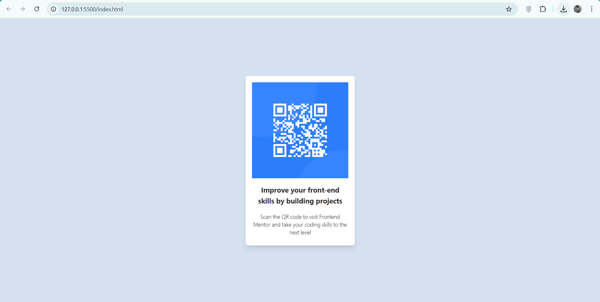
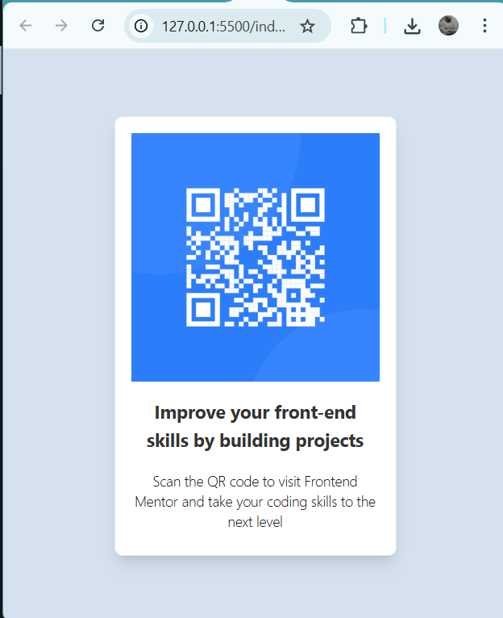

# QR Code Component
---

## Overview

This is my solution to the [Frontend Mentor QR Code Component challenge](https://www.frontendmentor.io/challenges/qr-code-component-iux_sIO_H).  
The goal was to build a visually accurate and responsive QR code component using HTML and Tailwind CSS.

## The Challenge

- Replicate the given QR code design as closely as possible.
- Ensure the layout is responsive for both mobile and desktop devices.
- Use semantic HTML and maintain clean, readable code.

## Screenshot




## Built With

- HTML5 – for structure
- Tailwind CSS – for styling
- Google Fonts (Outfit) – for typography
- Flexbox – for centering and layout

## Live Demo

- Live Site: [[Your Deployed Link Here](https://qrcomponent506.netlify.app/)]
- Frontend Mentor Solution Page: [Add Link Here](https://www.frontendmentor.io/solutions/qr-code-component-Z24nn2TAMQ)

## Project Structure

```
├── images/
│ ├── favicon-32x32.png
│ └── image-qr-code.png
├── index.html
├── style-guide.md
└── README.md
```

## What I Learned

- How to center content vertically and horizontally using Tailwind's `flex`, `justify-center`, and `items-center`.
- Applying custom background colors using Tailwind’s hex color classes (`bg-[#d5e1ef]`).
- Creating a card-like component with rounded corners, padding, and shadows.
- Using Google Fonts with Tailwind.
